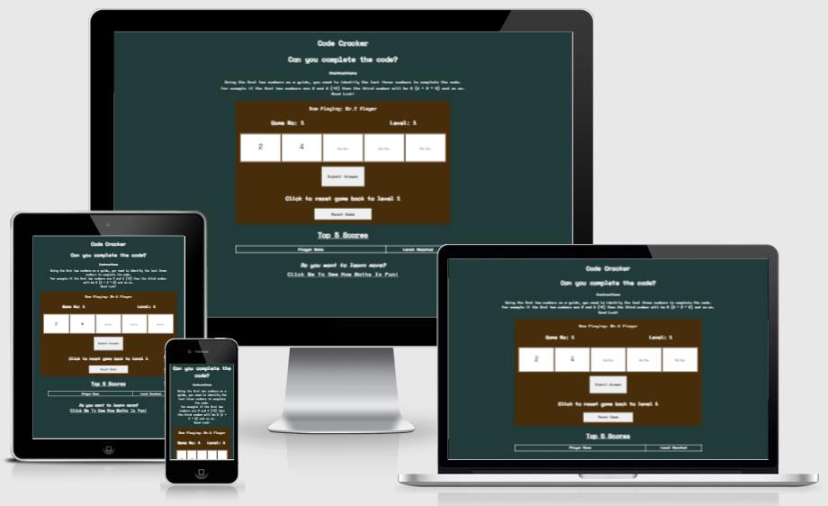

# Code Cracker

## Javascript Essentials Project

The website is designed to test the users knowledge of the times tables, while putting it into a 'code cracking' format. The idea behind the code cracking element is to make times tables slightly more fun for the user.

# INSERT PUBLISHED SITE LINK HERE

## Table of contents

- [UX](#UX)
    - [Business goals](#Business-goals)
    - [User goals](#User-goals)
    - [Structure of the website](#Structure-of-the-website)
    - [Website palette](#Website-palette)
- [Features](#Features)
- [Technology](#Technology)
- [Testing](#Testing)
    - [Functionality testing](#Functionality-testing)
    - [Compatability testing](#Compatability-testing)
    - [Code Validation](#Code-validation)
    - [Issues found during testing](#Issues-found-during-testing)
    - [Performance testing](#Performance-testing)
- [Deployment](#Deployment)
- [Credits](#Credits)
- [Screenshots](#Screenshots)

# UX

## Business goals

The Code Cracker site is designed to get the user interested in learning their times tables in a 'game' format. 

The user is only required to enter the 3rd, 4th and 5th numbers in the sequence. The 1st and 2nd numbers are the guide to what time table is being requested.

## User goals

- Users are challanged by the ever increasing difficulty of the times tables as they increase
- Users are given a 'level reached' score when they fail a level
- The 'level reached' score is logged in the game history section
- The game history section acts as a target for future games
- As each user is required to enter thier name it can be played by mulitiple players each trying to get further than the other players

## Structure of the website

The website has been designed to be responsive and easy to use / navigate across both static and mobile devices.

Users get feedback when they hover over the clickable links within the site.

## Website pallette

The colors were picked for their contrast to each other, as well as giving a 'game table' feel to the user.

- Background color: #213a3a
- Game playing area color: #472d0a
- Font color: #ffffff

[Return to the table of contents](#table-of-contents)

# Features

The website is simple single page format. The content of this single page is aligned centrally.

The site has the following features;

### Name input alert

This gives the user the opportunity to enter their name, in order to log their score to the game history section. If the user does not enter a name, then the default of 'Mr. E Player' (Mystery Player) will be entered.

After each failed level the game will ask if the player is still playing, it does this by asking by referencing the users name (see example below);

# INSERT IMAGE OF BEING ASKED IF ALEX IS STILL PLAYING HERE

### Instructions

The instructions give the user the guidance needed to solve the puzzles.

### Now playing title

This shows the user that they are logged into the current game

### Level number

This indicates to the player what level they are on. The levels increase after each completed code. The levels start on level 1 and have no upper limit.

### Code boxes

There are five code boxes, the first two are populated with the first two numbers in the code. The next three are empty and are where the user is to enter their answers.

### Submit button

The user has to option to submit their answers by either clicking 'enter' or by clicking the 'submit button'. Should the user click this button (or press enter) without completing each empty code entry, then an alert will be visible warning the user they have missed an answer.

### Reset button

Should the user wish to reset the game back to level 1, they can click this button and the game loop will begin again from the first level.

### Last game scores

This section is a table that is populated as the user completes / or not, levels. Their name and the level they reached is passed to this table and the data is allocated a new tabl row.

This table is setup to sort the scores and have them running in descending order.

The table also has a function that trims the rows so only the top 5 scores are shown.