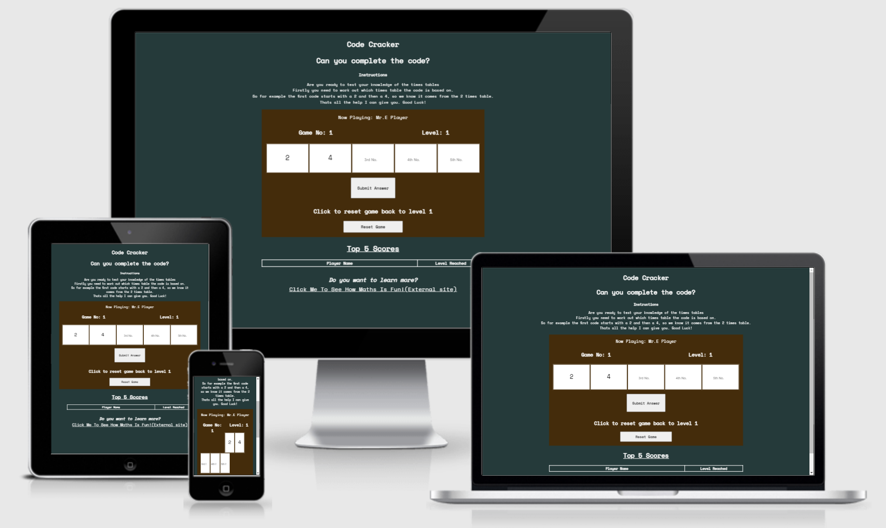

# Code Cracker

## Javascript Essentials Project

The website is designed to test the users knowledge of the times tables, while putting it into a 'code cracking' format. The idea behind the code cracking element is to make times tables slightly more fun for the user.

### [View the live website in Github pages](https://stephenlynch-ops.github.io/Code-Cracker/)

## Table of contents

- [UX](#UX)
    - [Business goals](#Business-goals)
    - [User goals](#User-goals)
    - [Structure of the website](#Structure-of-the-website)
    - [Website palette](#Website-palette)
- [Features](#Features)
- [Technology](#Technology)
- [Testing](#Testing)
    - [Functionality testing](#Functionality-testing)
    - [Compatibility testing](#Compatability-testing)
    - [Code Validation](#Code-validation)
    - [Issues found during testing](#Issues-found-during-testing)
    - [Performance testing](#Performance-testing)
- [Deployment](#Deployment)
- [Credits](#Credits)
- [Screenshots](#Screenshots)

# UX

## Business goals

The Code Cracker site is designed to get the user interested in learning their times tables in a 'game' format. 

The user is only required to enter the 3rd, 4th and 5th numbers in the sequence. The 1st and 2nd numbers are the guide to what time table is being requested.

## User goals

- Users are challenged by the ever increasing difficulty of the times tables as they increase
- Users are given a 'level reached' score when they fail a level
- The 'level reached' score is logged in the game history section
- The game history section acts as a target for future games
- As each user is required to enter their name it can be played by multiple players each trying to get further than the other players

## Structure of the website

The website has been designed to be responsive and easy to use / navigate across both static and mobile devices.

Users get feedback when they hover over the clickable links within the site.

## Website palette

The colors were picked for their contrast to each other, as well as giving a 'game table' feel to the user.

- Background color: #213a3a
- Game playing area color: #472d0a
- Font color: #ffffff

[Return to the table of contents](#table-of-contents)

# Features

The website is simple single page format. The content of this single page is aligned centrally.

The site has the following features;

### Name input alert

This gives the user the opportunity to enter their name, in order to log their score to the game history section. If the user does not enter a name, then the default of 'Mr. E Player' (Mystery Player) will be entered.

After each failed level the game will ask if the player is still playing, it does this by asking by referencing the users name (see example below);

### Instructions

- Gives instructions to the user to show the logic required to complete the puzzles

### Now playing title

- Gives feedback to the user, showing they are logged into the current game

### Game number

- Indicates to the player how many games have been attempted since the website was loaded

### Level number

- Indicates to the player what level they are on 
- Levels increase after each completed code 
- The levels start on level 1 and have no upper limit

### Code boxes

- Five code boxes
- First two are populated with the first two numbers in the code as a jumping off point for the user
- The next three are empty and are where the user is to enter their answers

### Submit button

- User has to option to submit their answers by either clicking 'enter' or by clicking the 'submit button' 
- An alert shows if the user tries to submit an incomplete code

### Reset button

- Allows the user to reset the game back to level 1
- Current game status (when reset is pressed) is logged as a game

### Last game scores

- Table that is populated as the user completes / or not, levels
- Users name and level reached is passed to this table
- Table sorts scores and are shown in descending order
- Table maintains only the top 5 scores

### External Math site

- External learning resource for users
- Not affiliated with Code Cracker

### Future implementations

- Remove link to external site
- Include an interactive time table page, similar to that shown on external site

[Return to the table of contents](#table-of-contents)

# Technology

### HTML

- The structure language of the site

### CSS

- The style language of the site

### Javascript

- The responsive language of the site to allow interaction for the user

### Font Awesome

- The library for the social media icons used in the footer

### Google fonts

- For the fonts used throughout the site

### Github

- Where the site is hosted

### Gitpod

- Where the site was developed

[Return to the table of contents](#Table-of-contents)

# Testing

## Functionality testing

I developed the site using Chrome developer tools and latterly using Firefox developer tools.

## Compatibility testing

I tested the mobile compatibility for the site using the default options on Chrome which covered everything from Galaxy fold to Nest Hub Max. 

## Code validation

The code has been run through validator.w3.org to check the validity of the HTML with no errors or warnings.

The CSS was tested using jigsaw.w3.org and again no errors were found.

The Javascript was tested using JSHint.com and no errors were found.

## Issues found during testing

When testing I had an issue where the game was stuck on the 3 times table, despite being on level 5 (6 times table). I couldn't determine why this problem only happened after the first round and so ended up rewriting the runGame and levelUpdate functions.

There were a couple of bugs when the sorting of the scores was implemented into the table.

Initially the sorting failed. After a check of the code I found the comparison argument was the wrong way around. The example I found on w3schools.com was designed to sort the table in ascending order - I didn't realise this and so the sorting was failing because as I tested the site I kept trying to beat the last score. Hence the better score went to the bottom of the table. This was rectified by using '<' instead of '>'. As below;

I also had a problem with the table not recording the top 5 scores, it would cut off after 3 scores. Code below;

This was a simple error to find and resolve as I had forgotten to include the table headers in the row count.

There was another bug, that was found by mistake. This was the players name was blank if they clicked 'cancel' when prompted to enter their name, or if they opened the site link in a new tab.

This was solved by including a userName == null in the if statement as below;

    Modification: if (username == "" || userName == null)

## Performance testing

- Site has been evaluated by lighthouse and the score card is below.

[Return to the table of contents](#table-of-contents)

# Deployment

The site is deployed from GitHub. In order to do this I carried out the following actions;

1. Click settings

2. Click pages

3. Click the 'none' button and select 'main' from the drop down box

4. Click the save button

5. Click the link to the page - after a small wait

[Return to the table of contents](#Table-of-contents)

# Credits

The site was influenced by the Love Maths site that we made as part of the course. I used the general layout as a guide to get a simple, clean layout. 

The idea behind the site was influenced by my son, who is learning his times tables at school and my other son who is a huge fan of Numberblocks - especially when they join together. I wanted to make something that can be used by a wide group of ages to help make learning about the times table more fun.

I referred to w3schools.com and stackoverflow.com for help when i got stuck and repl.it when i needed to see how some code worked.

# Screenshots

## Home page

### Top 5 scores

[Return to the table of contents](#table-of-contents)